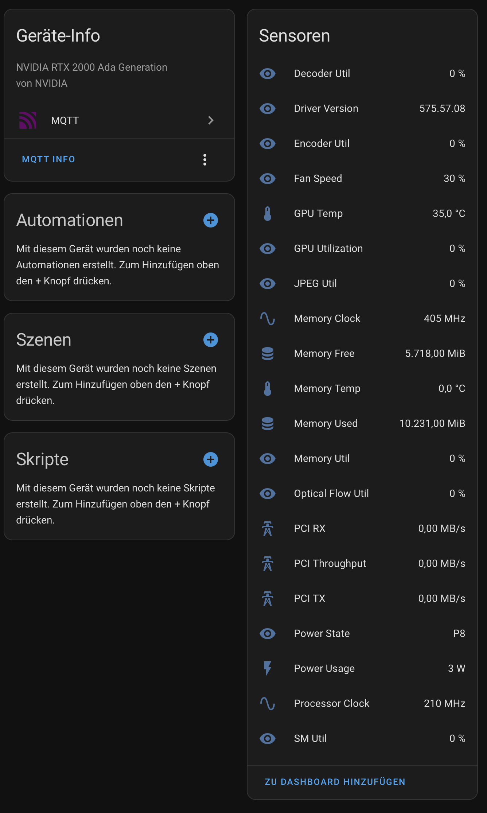

[](https://pkg.go.dev/github.com/rbnhln/smi2mqtt)
[](https://goreportcard.com/report/github.com/rbnhln/smi2mqtt)

# smi2mqtt

A simple and lightweight service to publish NVIDIA GPU statistics from `nvidia-smi` to an MQTT broker. It includes optional support for Home Assistant's MQTT auto-discovery feature, allowing for seamless integration into your smart home setup.

Monitored stats include:
*   GPU and Memory Utilization
*   Power Draw and Power State
*   Memory Usage (Used, Free, Total)
*   Temperature
*   Fan Speed

## Prerequisites

Before you begin, ensure that the `nvidia-smi` command-line utility is installed and working on your host machine. You can test this by running:

```sh
nvidia-smi
```

If this command fails, you need to install the appropriate NVIDIA drivers for your system.

## Usage

You can run `smi2mqtt` as a Docker container or as a standalone command-line application. In both cases, you must provide the address of your MQTT broker.

### 1. Docker (Recommended)

This is the easiest way to get started. You need a working Docker installation and the [NVIDIA Container Toolkit](https://github.com/NVIDIA/nvidia-container-toolkit) to allow containers to access the GPU.

**Example `docker-compose.yml`:**

```yaml
---
services:
  smi2mqtt:
    container_name: smi2mqtt
    image: ghcr.io/rbnhln/smi2mqtt:latest
    volumes:
      - ./data:/opt/smi2mqtt
    restart: unless-stopped
    deploy:
      resources:
        reservations:
          devices:
            - driver: nvidia
              count: all 
              capabilities: [gpu]
...
```

**Configuration:**

1.  Create a directory for your configuration (e.g., `./data`).
2.  Populate the `config.json`with your data and store it under `.data/config.json`.

**Example `config.json`:**

```json
{
  "broker": "tcp://192.168.1.100:1883",
  "mqtt_username": "your_mqtt_user",
  "mqtt_password": "your_mqtt_password",
  "ha": true,
  "update_interval": 1
}
```

### 2. Command-Line Application

You can also run the application directly on your host. Configuration can be provided via command-line arguments or a configuration file.

*   **With a config file:** Place your `config.json` at `/opt/smi2mqtt/config.json` and run the application.
*   **With CLI arguments:** Provide all necessary parameters directly on the command line.

```sh
./smi2mqtt --broker "tcp://192.168.1.100:1883" --username "user" --password "pass"
```

### 3. Build from Source

If you want to build the executable yourself:

1.  Clone the repository.
2.  Download the Go module dependencies:
    ```sh
    go mod download
    ```
3.  Build the application. Here is an example for Linux (x86_64):
    ```sh
    make build_x86_64
    ```
    or 
    ```
    GOARCH=amd64 GOOS=linux CGO_ENABLED=0 go build -ldflags='-s' -o=./bin/smi2mqtt ./cmd
    ```
    You can change `GOOS` and `GOARCH` to build for any other platform supported by Go.

## Configuration Options

You can configure the application using a `config.json` file or by passing command-line arguments. CLI arguments will always override the values in the config file.

| CLI Argument     | Config Key         | Description                                  | Default                  |
| ---------------- | ------------------ | -------------------------------------------- | ------------------------ |
| `-broker`        | `broker`           | MQTT broker address (e.g., tcp://host:1883)  | (none)                   |
| `-topic`         | `topic`            | Base MQTT topic for publishing stats         | `smi2mqtt`               |
| `-username`      | `mqtt_username`    | Username for the MQTT server                 | (empty)                  |
| `-password`      | `mqtt_password`    | Password for the MQTT server                 | (empty)                  |
| `-ha`            | `ha`               | Enable Home Assistant auto-discovery         | `true`                   |
| `-interval`      | `update_interval`  | GPU Readout interval in seconds           | `1`                      |
| `-version`       | (n/a)              | Display version and exit                     | `false`                  |

## MQTT Details

*   **Broker URL:** Supports `tcp://`, `tcps://` (TLS), `ws://` (Websocket), and `wss://` (secure Websocket) protocols.
*   **Authentication:** If your broker doesn't require a username and password, simply leave these fields empty in your configuration.
*   **Client ID:** If you do not provide a `client_id` in the config file, a unique ID will be automatically generated and saved on the first run.
*   **Topic:** All stats will be published under the base topic. For example, with the default topic `smi2mqtt`, the power draw for GPU 0 will be at `smi2mqtt/gpu-uuid/power_draw`.

## Home Assistant Integration

When Home Assistant auto-discovery is enabled (`-ha=true` or `"ha": true`), `smi2mqtt` will automatically publish configuration messages to Home Assistant. This will create devices and entities for each detected GPU, which you can then add to your dashboards.



## Licensing

This project is licensed under the MIT License. See the [LICENSE](LICENSE) file for details.

This software depends on other open-source libraries, which are licensed as follows:

*   **paho.mqtt.golang**: Copyright (c) 2016 Eclipse Foundation.
    This software is licensed under the Eclipse Public License v2.0. A copy of the license is available at [https://www.eclipse.org/legal/epl-2.0/](https://www.eclipse.org/legal/epl-2.0/).

*   **google/uuid**: Copyright (c) 2009,2014 Google Inc.
    This software is licensed under the 3-Clause BSD License. A copy of the license is available at [https://github.com/google/uuid/blob/master/LICENSE](https://github.com/google/uuid/blob/master/LICENSE).